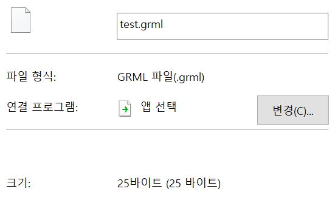

# SimpleFileCompressor  

Implement File Compressor using Huffman Code Algorithm

Works perfectly on all types of files  

## before size (original) 367B  

   

## compressed size 25B  

  

## decompressed 367B  

  

TODO
=======================================  
Add more detailed explanation to README.md  
Make it available for actual use  
Clean up source codes  

~~Make it work for all types of files  ~~
~~### -Guess why it doesn't work with other types-  ~~
~~I think there is a problem with toString when read file. Maybe string doesn't surpport certain characters.~~
~~So, I'll change structure from string-based to byte-based~~
