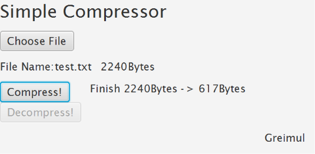
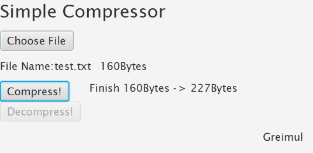
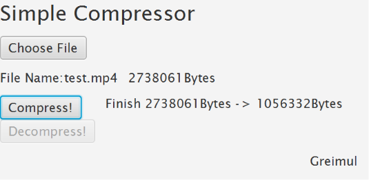

# SimpleFileCompressor  

Implement File Compressor using Huffman Code Algorithm

Works perfectly on all types of files  

# Issue   
Can't compress big size file   
   
# 0.2 ver.   
Inject header information to .grml file   
       

Because of this update, if the file size is small, it can become large size when compressed.   
Increase in file size is inevitable due to header information.   
   
### TODO   
Connect decompress function to GUI   

# 0.1 ver.   

   

Implement GUI with TornadoFx   
Refactoring source codes structure   

0.1 version only has compress function.   
Compress original file to .grml file   

### TODO    
Connect decompress function to GUI   
Inject header information to .grml file    

# Concept Version   

Implement file compress function and file decompress function.   
   

## before size (original) 367B  

   

## compressed size 25B  

  

## decompressed 367B  

  

### TODO
=======================================  
Add more detailed explanation to README.md  
Make GUI  
Clean up source codes  

~~Make it work for all types of files~~  
->I solved this problem by changing structure from string-based to byte-based  

