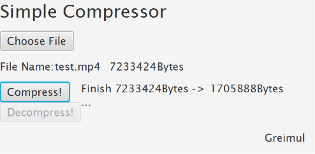
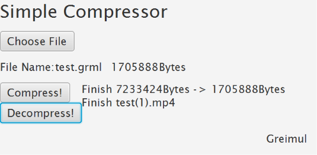
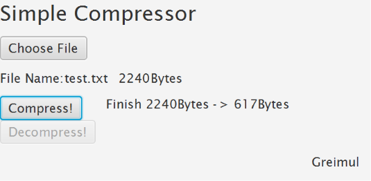
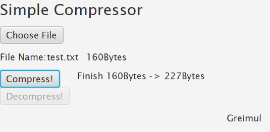
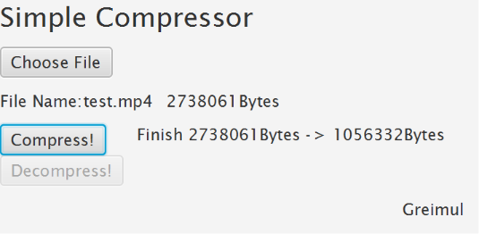

# SimpleFileCompressor  

Implement File Compressor using Huffman Code Algorithm

Works perfectly on all types of files  

# Issue   
Can't compress big size file   
   
# 1.0 ver.   
         

Connect decompress function to GUI.   
When decompressed, if there is same name file, decompressed file name automatically changed.   

### TODO
Add more detailed explanation to README.md     

   
# 0.2 ver.   
Inject header information to .grml file   
       

Because of header information, certain files become larger when compressed.   
This happens in files which have low compression rate.   
   
### TODO   
Connect decompress function to GUI   

# 0.1 ver.   

   

Implement GUI with TornadoFx   
Refactoring source codes structure   

0.1 version only has compress function.   
Compress original file to .grml file   

### TODO    
Connect decompress function to GUI   
Inject header information to .grml file    

# Concept Version   

Implement file compress function and file decompress function.   
   

## before size (original) 367B  

   

## compressed size 25B  

  

## decompressed 367B  

  

### TODO 
Add more detailed explanation to README.md  
Make GUI  
Clean up source codes  

~~Make it work for all types of files~~  
->I solved this problem by changing structure from string-based to byte-based  

